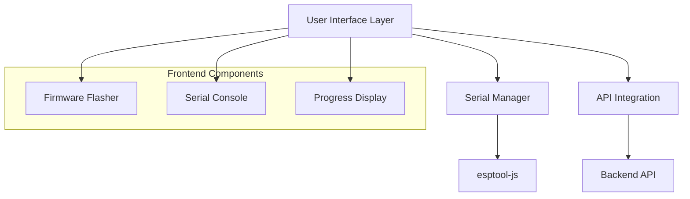

# Design Document

## Overview

The ESP Firmware Flasher system provides a web-based interface for flashing ESP32 firmware using esptool-js. The design emphasizes simplicity for non-technical users while providing advanced options for technical users. The system integrates with the existing Attractap infrastructure and ensures proper resource management to prevent serial port conflicts.

## Architecture

### High-Level Architecture



### Component Architecture

The system follows a modular component structure with proper separation of concerns:

1. **Serial Port Manager**: Centralized management of serial port access
2. **Firmware Flasher Component**: Main flashing interface
3. **Serial Console Component**: Read-only console for device monitoring
4. **Progress Display Component**: User-friendly progress indication
5. **Error Handler**: Centralized error handling and user feedback

## Components and Interfaces

### 1. Serial Port Manager

**Purpose**: Centralized management of serial port access to prevent conflicts

**Interface**:
```typescript
interface SerialPortManager {
  requestPort(): Promise<SerialPort>;
  releasePort(port: SerialPort): void;
  isPortInUse(port: SerialPort): boolean;
  getAvailablePorts(): SerialPort[];
}
```

**Key Features**:
- Singleton pattern to ensure only one instance manages ports
- Port reservation system to prevent conflicts
- Automatic cleanup on component unmount
- Browser tab coordination using localStorage

### 2. Firmware Flasher Component

**Location**: `apps/frontend/src/app/attractap/Installer/FirmwareFlasher/`

**Structure**:
```
FirmwareFlasher/
├── index.tsx
├── de.json
├── en.json
├── PortSelector/
│   ├── index.tsx
│   ├── de.json
│   └── en.json
├── ProgressDisplay/
│   ├── index.tsx
│   ├── de.json
│   └── en.json
└── ErrorDisplay/
    ├── index.tsx
    ├── de.json
    └── en.json
```

**Interface**:
```typescript
interface FirmwareFlasherProps {
  firmware: AttractapFirmware;
  onComplete: (success: boolean) => void;
  onCancel: () => void;
}
```

**Key Features**:
- Simple, wizard-like interface
- Port selection with device detection
- Progress tracking with user-friendly messages
- Error handling with actionable solutions
- Advanced mode toggle for technical details

### 3. Serial Console Component

**Location**: `apps/frontend/src/app/attractap/SerialConsole/`

**Structure**:
```
SerialConsole/
├── index.tsx
├── de.json
├── en.json
└── ConsoleOutput/
    ├── index.tsx
    ├── de.json
    └── en.json
```

**Interface**:
```typescript
interface SerialConsoleProps {
  isOpen: boolean;
  onClose: () => void;
  autoConnect?: boolean;
  port?: SerialPort;
}
```

**Key Features**:
- Read-only console output
- Auto-scrolling with line limits
- Connection status indicator
- Clear/export functionality
- Responsive design for mobile use

### 4. Progress Display Component

**Purpose**: Provides user-friendly progress indication during flashing

**Interface**:
```typescript
interface ProgressDisplayProps {
  stage: FlashingStage;
  progress: number;
  message: string;
  showAdvanced: boolean;
  onToggleAdvanced: () => void;
  logs: string[];
}

enum FlashingStage {
  CONNECTING = 'connecting',
  DOWNLOADING = 'downloading',
  ERASING = 'erasing',
  FLASHING = 'flashing',
  VERIFYING = 'verifying',
  COMPLETE = 'complete',
  ERROR = 'error'
}
```

### 5. API Integration Service

**Purpose**: Handles firmware binary download and metadata management

**Interface**:
```typescript
interface FirmwareApiService {
  downloadFirmware(firmware: AttractapFirmware): Promise<Uint8Array>;
  validateFirmware(data: Uint8Array, expectedHash?: string): boolean;
  getFirmwareUrl(firmware: AttractapFirmware): string;
}
```

## Data Models

### Flashing State Management

```typescript
interface FlashingState {
  stage: FlashingStage;
  progress: number;
  message: string;
  error?: FlashingError;
  logs: LogEntry[];
  startTime?: Date;
  endTime?: Date;
}

interface LogEntry {
  timestamp: Date;
  level: 'info' | 'warn' | 'error' | 'debug';
  message: string;
  technical?: boolean; // Hide from simple view
}

interface FlashingError {
  code: string;
  message: string;
  technicalDetails?: string;
  solutions: string[];
  recoverable: boolean;
}
```

### Serial Port State

```typescript
interface SerialPortState {
  port?: SerialPort;
  connected: boolean;
  inUse: boolean;
  owner: string; // Component identifier
  baudRate: number;
  lastActivity?: Date;
}
```

## Error Handling

### Error Categories

1. **Connection Errors**
   - Web Serial API not supported
   - Permission denied
   - Port selection cancelled
   - Device disconnected

2. **Firmware Errors**
   - Download failed
   - Invalid firmware format
   - Checksum mismatch
   - Incompatible device

3. **Flashing Errors**
   - Device not in bootloader mode
   - Flash memory errors
   - Verification failures
   - Timeout errors

### Error Display Strategy

- **Simple Mode**: User-friendly messages with suggested actions
- **Advanced Mode**: Technical details and logs
- **Progressive Disclosure**: Start simple, allow drilling down
- **Actionable Solutions**: Clear next steps for each error type

### Error Recovery

```typescript
interface ErrorRecovery {
  canRetry: boolean;
  retryAction?: () => Promise<void>;
  alternativeActions: RecoveryAction[];
}

interface RecoveryAction {
  label: string;
  description: string;
  action: () => Promise<void>;
}
```

## Testing Strategy

### Unit Testing

1. **Serial Port Manager**
   - Port reservation and release
   - Conflict detection
   - Cleanup on unmount

2. **Firmware API Service**
   - Binary download and validation
   - Error handling for network issues
   - MD5 hash verification

3. **Progress Display**
   - State transitions
   - Message formatting
   - Advanced mode toggle

### Integration Testing

1. **End-to-End Flashing**
   - Complete flashing workflow
   - Error scenarios and recovery
   - Progress tracking accuracy

2. **Serial Console**
   - Data reception and display
   - Connection management
   - Resource cleanup

### Browser Testing

1. **Web Serial API Compatibility**
   - Chrome/Edge support verification
   - Permission handling
   - Device detection

2. **Multi-tab Scenarios**
   - Port conflict prevention
   - State synchronization
   - Resource cleanup

## Implementation Phases

### Phase 1: Core Infrastructure
- Serial Port Manager implementation
- Basic esptool-js integration
- Simple progress display

### Phase 2: User Interface
- Firmware Flasher component
- Error handling and display
- Translation system integration

### Phase 3: Serial Console
- Read-only console implementation
- Integration with reader list
- Connection management

### Phase 4: Advanced Features
- Advanced mode toggle
- Detailed logging
- Export functionality

## Security Considerations

1. **Web Serial API Permissions**
   - User must explicitly grant access
   - Permissions are origin-specific
   - No persistent device access

2. **Firmware Validation**
   - MD5 hash verification
   - File type validation
   - Size limit enforcement

3. **Resource Management**
   - Automatic cleanup on page unload
   - Timeout handling for stuck operations
   - Memory management for large binaries

## Performance Considerations

1. **Firmware Download**
   - Streaming download for large files
   - Progress indication during download
   - Retry mechanism for failed downloads

2. **Console Output**
   - Line buffering and limits
   - Efficient DOM updates
   - Virtual scrolling for large outputs

3. **Memory Management**
   - Cleanup of binary data after flashing
   - Log rotation to prevent memory leaks
   - Efficient string handling for console output