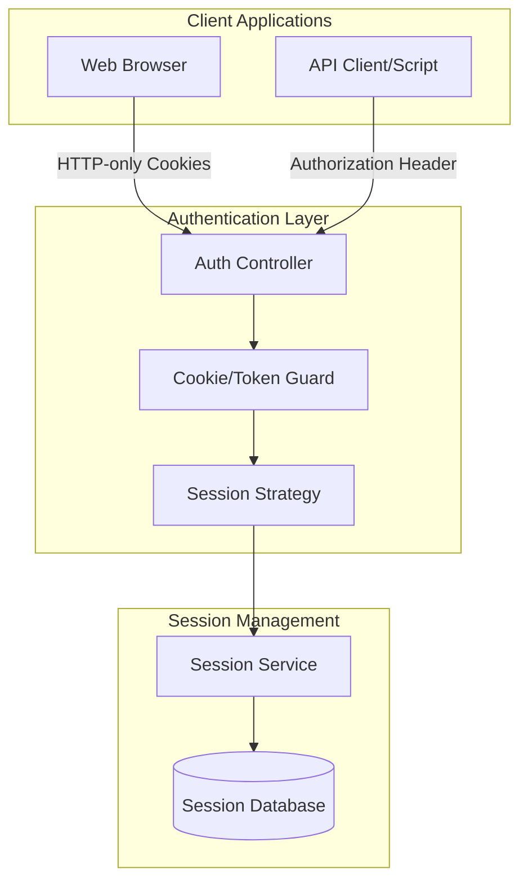
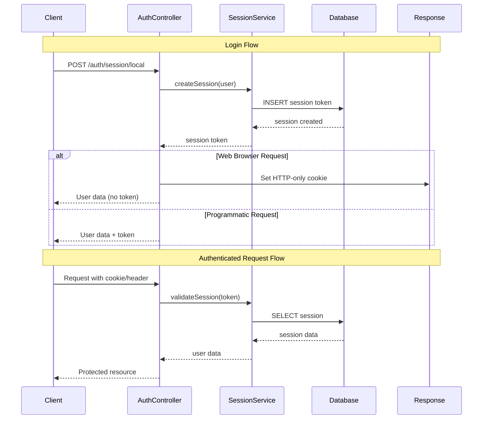

# Design Document

## Overview

This design outlines the refactoring of the authentication system from JWT tokens stored in localStorage to database-stored session tokens with secure HTTP-only cookies for web browsers, while maintaining Authorization header support for programmatic access. The new system provides better security, session control, and eliminates client-side token storage vulnerabilities.

## Architecture

### High-Level Architecture



### Authentication Flow



## Components and Interfaces

### Session Entity

A new database entity to store session information:

```typescript
@Entity()
export class Session {
  @PrimaryGeneratedColumn()
  id: number;

  @Column({ type: 'text', unique: true })
  token: string;

  @Column({ type: 'int' })
  userId: number;

  @Column({ type: 'text', nullable: true })
  userAgent: string | null;

  @Column({ type: 'text', nullable: true })
  ipAddress: string | null;

  @Column({ type: 'datetime' })
  expiresAt: Date;

  @CreateDateColumn()
  createdAt: Date;

  @UpdateDateColumn()
  lastAccessedAt: Date;

  @ManyToOne(() => User, { onDelete: 'CASCADE' })
  user: User;
}
```

### Session Service

Core service for session management:

```typescript
interface SessionService {
  createSession(user: User, metadata?: SessionMetadata): Promise<string>;
  validateSession(token: string): Promise<User | null>;
  refreshSession(token: string): Promise<string>;
  revokeSession(token: string): Promise<void>;
  revokeAllUserSessions(userId: number): Promise<void>;
  cleanupExpiredSessions(): Promise<void>;
}

interface SessionMetadata {
  userAgent?: string;
  ipAddress?: string;
  expiresIn?: number; // seconds
}
```

### Authentication Strategy

New Passport strategy for session-based authentication:

```typescript
@Injectable()
export class SessionStrategy extends PassportStrategy(Strategy, 'session') {
  constructor(private sessionService: SessionService) {
    super({
      cookieName: 'auth-session',
      headerName: 'authorization',
      passReqToCallback: true,
    });
  }

  async validate(req: Request, token: string): Promise<User | null> {
    return this.sessionService.validateSession(token);
  }
}
```

### Cookie Configuration

Secure cookie settings based on environment:

```typescript
interface CookieConfig {
  name: string;
  httpOnly: boolean;
  secure: boolean;
  sameSite: 'strict' | 'lax' | 'none';
  maxAge: number;
  path: string;
  domain?: string;
}

const cookieConfig: CookieConfig = {
  name: 'auth-session',
  httpOnly: true,
  secure: process.env.ATTRACCESS_URL?.startsWith('https://') ?? false,
  sameSite: 'lax',
  maxAge: 24 * 60 * 60 * 1000, // 24 hours
  path: '/',
};
```

### Dual Authentication Guard

Enhanced guard supporting both cookie and header authentication:

```typescript
@Injectable()
export class DualAuthGuard implements CanActivate {
  constructor(private sessionStrategy: SessionStrategy) {}

  async canActivate(context: ExecutionContext): Promise<boolean> {
    const request = context.switchToHttp().getRequest();

    // Priority: Authorization header > Cookie
    const authHeader = request.headers.authorization;
    const sessionCookie = request.cookies['auth-session'];

    let token: string | null = null;

    if (authHeader?.startsWith('Bearer ')) {
      token = authHeader.substring(7);
    } else if (sessionCookie) {
      token = sessionCookie;
    }

    if (token) {
      const user = await this.sessionStrategy.validate(request, token);
      if (user) {
        request.user = user;
        return true;
      }
    }

    return false;
  }
}
```

## Data Models

### Session Token Generation

Random token generation using cryptographically secure methods:

```typescript
function generateSessionToken(): string {
  return crypto.randomBytes(32).toString('base64url');
}
```

### Session Expiration

Configurable session expiration with automatic cleanup:

```typescript
interface SessionConfig {
  defaultExpirationHours: number;
  maxExpirationHours: number;
  cleanupIntervalHours: number;
  extendOnActivity: boolean;
}

const sessionConfig: SessionConfig = {
  defaultExpirationHours: 24,
  maxExpirationHours: 168, // 7 days
  cleanupIntervalHours: 6,
  extendOnActivity: true,
};
```

## Error Handling

### Session-Specific Exceptions

```typescript
export class SessionExpiredException extends UnauthorizedException {
  constructor() {
    super('Session has expired');
  }
}

export class SessionNotFoundException extends UnauthorizedException {
  constructor() {
    super('Session not found');
  }
}

export class SessionRevokeException extends UnauthorizedException {
  constructor() {
    super('Session has been revoked');
  }
}
```

### Error Response Handling

Consistent error responses for authentication failures:

```typescript
interface AuthErrorResponse {
  statusCode: number;
  message: string;
  error: string;
  timestamp: string;
  path: string;
}
```

## Testing Strategy

### Unit Tests

1. **Session Service Tests**

   - Token generation uniqueness
   - Session creation and validation
   - Expiration handling
   - Cleanup operations

2. **Authentication Strategy Tests**

   - Cookie extraction and validation
   - Header token processing
   - User resolution from sessions

3. **Guard Tests**
   - Dual authentication priority
   - Request context handling
   - Error scenarios

### Integration Tests

1. **Authentication Flow Tests**

   - Login with cookie setting
   - Authenticated requests with cookies
   - Programmatic authentication with headers
   - Logout and session cleanup

2. **Security Tests**

   - Cookie security attributes
   - Session token randomness
   - Concurrent session handling
   - Session fixation prevention

3. **Session Token Tests**
   - Session token validation
   - API client authentication with session tokens
   - Mixed authentication scenarios

### End-to-End Tests

1. **Web Browser Flow**

   - Complete login/logout cycle
   - Session persistence across requests
   - Automatic cookie handling

2. **API Client Flow**
   - Token-based authentication
   - No cookie interference
   - Programmatic session management

## Migration Strategy

### Database Migration

1. Create new `Session` table
2. Add indexes for performance:
   - `token` (unique)
   - `userId` for user session queries
   - `expiresAt` for cleanup operations

### Code Migration

1. **Phase 1**: Implement session infrastructure

   - Add Session entity and service
   - Create session strategy
   - Implement dual authentication guard

2. **Phase 2**: Update authentication endpoints

   - Modify login endpoints to support both modes
   - Add session refresh endpoint
   - Update logout to handle sessions

3. **Phase 3**: Frontend integration

   - Remove localStorage token handling
   - Update API client configuration
   - Test cookie-based authentication

4. **Phase 4**: Cleanup and optimization
   - Remove unused JWT-specific code (future)
   - Optimize session cleanup
   - Monitor performance

### Configuration Changes

Environment variables for session management:

```env
# Session Configuration
SESSION_EXPIRATION_HOURS=24
SESSION_MAX_EXPIRATION_HOURS=168
SESSION_CLEANUP_INTERVAL_HOURS=6
SESSION_EXTEND_ON_ACTIVITY=true

# Cookie Configuration
COOKIE_SAME_SITE=lax
```

## Security Considerations

### Cookie Security

1. **HTTP-Only**: Prevents JavaScript access
2. **Secure**: HTTPS-only transmission
3. **SameSite**: CSRF protection
4. **Path/Domain**: Scope limitation

### Session Security

1. **Token Randomness**: Cryptographically secure generation
2. **Database Storage**: Server-side session control
3. **Expiration**: Automatic cleanup of old sessions
4. **Revocation**: Immediate session invalidation capability

### Authentication Priority

1. **Header Priority**: Authorization header tokens take precedence over cookies
2. **Session Control**: Complete server-side session management
3. **Token Security**: Cryptographically secure session tokens

## Performance Considerations

### Database Optimization

1. **Indexes**: Efficient session lookups
2. **Cleanup**: Regular removal of expired sessions
3. **Connection Pooling**: Efficient database usage

### Caching Strategy

1. **Session Caching**: In-memory cache for active sessions
2. **Cache Invalidation**: Immediate updates on session changes
3. **TTL Management**: Automatic cache expiration

### Monitoring

1. **Session Metrics**: Active session counts
2. **Performance Metrics**: Authentication response times
3. **Error Tracking**: Authentication failure rates
